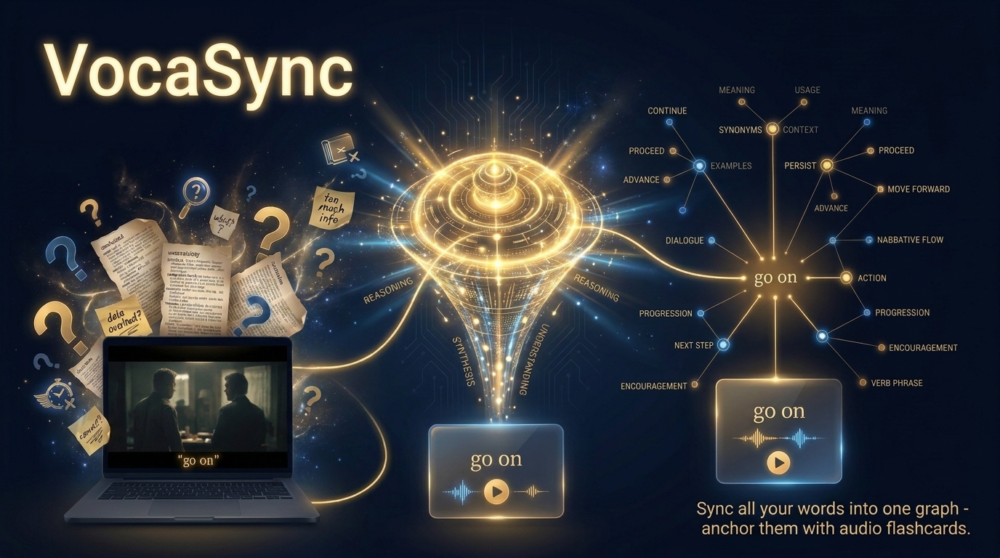
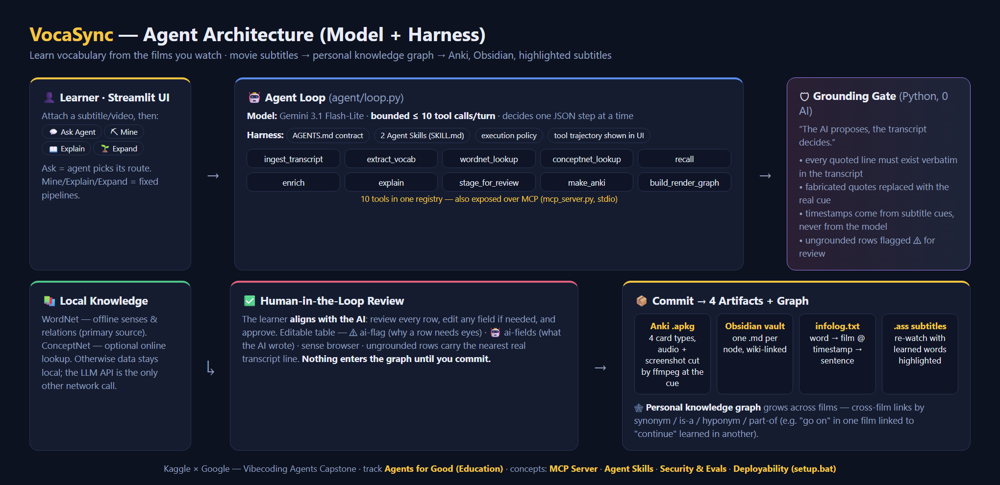

# VocaSync

> **"Sync all your words into one graph — anchor them with audio flashcards."** — *your vocabulary's second brain*

[](https://creativecommons.org/licenses/by/4.0/)

An AI agent that turns the media you already watch or listen to (films, shows, podcasts, `.srt`/`.vtt` subtitles, `.txt`/`.md` notes) into a **personal vocabulary knowledge-graph that grows across sessions** — plus an Anki deck with audio cut straight from the source. Attach a video or audio (no subtitles? **Whisper transcribes it for you**), ask the agent or press **Mine**, review what the AI proposes, and **Commit** — every committed word remembers *where you met it* (source, sentence, timestamp) and *how it relates* to everything else you already know.

*Signatures: "The AI proposes, the transcript decides." · "Your data stays local — the only network calls are the LLM API and an optional ConceptNet lookup."*



## 🎬 Demo

- **Video (YouTube):** https://www.youtube.com/watch?v=b0RqXDL3dnU
- **Architecture diagram:** [`docs/architecture.png`](docs/architecture.png)

## ⚡ Quickstart (Windows)

**Double-click `setup.bat`.** First run: it checks Python, creates a `.venv`, installs `requirements.txt`, downloads the NLTK WordNet data, then launches the app and opens **http://localhost:8501** in your browser. Later runs skip straight to launch. No Python knowledge required.

You need an API key. Copy the template and set **one** provider:

```bash
cp .env.example .env        # then set GEMINI_API_KEY=...   (only the variable name — never commit a key)
```

`ffmpeg` must be available for Anki audio/screenshot (a bundled `imageio-ffmpeg` binary is used by default; otherwise set `FFMPEG_PATH` in `.env`).

> **No key?** The app still runs: the deterministic **Expand** action works; **Ask / Mine / Explain** (which call the LLM) are disabled with a clear banner.

<details><summary>Manual setup (macOS / Linux, or without <code>setup.bat</code>)</summary>

```bash
git clone <repo-url> && cd capstone_GD4_askfix
python -m venv .venv
# Windows: .venv\Scripts\activate   |   macOS/Linux: source .venv/bin/activate
pip install -r requirements.txt
python -m nltk.downloader wordnet omw-1.4 stopwords
python -m spacy download en_core_web_sm        # optional — enrich falls back to regex
cp .env.example .env                            # set GEMINI_API_KEY=...
python -m streamlit run app.py
```
</details>

## ✨ Main features

- **Ask Agent** — the primary workflow. Ask in plain language ("have I learned 'go on'?", "find useful words from this scene"); the agent reads your request, picks from ten tools, chains its own sequence, and answers from your graph + WordNet as separated layers. A Tool Trajectory expander shows exactly which tools it chose.
- **Grounded, verbatim quotes** — every quoted line must exist word-for-word in the transcript; a Python guardrail replaces fabricated quotes with the real cue and takes timestamps from the subtitle cues, never from the model.
- **Cross-film links** — a word met in one film is automatically wired to related words learned in another (by synonym / is-a / hyponym / part-of).
- **Human-in-the-loop review** — an in-app editable table; you align with the AI: review each row, fix a wrong WordNet sense on the spot, see which fields the AI authored, catch `ungrounded` example sentences, then approve.
- **Commit** — the single write point to your personal graph; a second validator partitions any invalid rows with a per-row reason. Nothing reaches the graph until you commit.
- **Artifacts on commit** — an Anki deck (Basic / Cloze / Dictation / Definition — 4 card types; audio + mid-frame screenshot cut by ffmpeg when a video matches), an Obsidian vault (one `.md` per node, wiki-linked), an infolog (word → source @ time → sentence), and a highlighted `.ass` subtitle for re-watching.
- **Graph view** — interactive, with meaning-source badges (Ⓦ WordNet / 🤖 AI / ✍ you) and gold-ringed new nodes.

## 🏗️ Architecture — Model + Harness



```
TOOLS (10)  recall · ingest_transcript · extract_vocab · wordnet_lookup ·
            conceptnet_lookup · enrich · build_render_graph · make_anki ·
            explain · stage_for_review
AGENT       LLM tool-calling loop, bounded at 10 tool calls/turn. Read-only against
            the graph — its only write tool is stage_for_review, which writes to the
            REVIEW QUEUE, never the graph. Two paths:
              run_agent  (Ask Agent)           — LLM chooses & chains tools itself
              run_intent (Mine/Explain/Expand) — fixed deterministic pipeline
            Also exposed over MCP (mcp_server.py, stdio).
HARNESS     AGENTS.md (operating contract) · 2 Agent Skills (SKILL.md) ·
            execution policy · PersonalGraph JSON (persistent memory) ·
            Pydantic schema (data contract) · in-app HITL review · .env (secrets)
```

**Three design rules carry the system:**
- **Deterministic first.** WordNet (local, offline) is the backbone — senses, synonyms, antonyms, hypernyms as verifiable edges; the AI only picks which sense fits and fills fields a dictionary can't. Every AI-authored field is marked `source_map='ai'` and surfaced in review. ConceptNet is an **optional online lookup**, called only when WordNet is insufficient — and if its public API is unreachable (e.g. a 502) it simply returns no extra edges, **never crashing the app** (word meanings still come from local WordNet).
- **One write point.** Nothing reaches the graph except `app.commit_approved`, which runs only when the human presses **Commit**. The agent cannot write the graph. Exports are generated *after* commit, from the approved subset only.
- **Grounded, self-correcting.** `stage_for_review` runs a two-tier gate — the word must appear in its sentence *and* that sentence must occur in the transcript. Fabricated examples are flagged `ungrounded` and the real transcript line is returned so the model corrects itself.

## 🧠 Course concepts (Capstone)

Agent = Model + Harness · **MCP Server** · **Agent Skills** · **Evals + Security** · **Deployability (`setup.bat`)** · Spec-Driven

## 🛠️ Tech stack

Python · Streamlit · Whisper · ffmpeg (imageio-ffmpeg) · NLTK WordNet · spaCy · networkx · pyvis · genanki · Gemini (tool-use)

## ▶️ Usage

```bash
python -m streamlit run app.py             # run the app

# Optional CLIs
python mcp_server.py                       # MCP server (stdio) exposing the 10 tools
python evals/sense_eval.py                 # LLM-as-judge sense accuracy
python evals/mine_corrections.py           # K-Means mining of the correction log

# Tests (no pytest — run each file directly, fully offline)
.venv/Scripts/python tests/test_pipeline.py
.venv/Scripts/python tests/test_grounding_transcript.py
# ... (15 offline test files under tests/; test_conceptnet* hits a live API and is skipped)
```

**Typical flow in the app:**
1. Attach media — upload your own video/audio or `.srt`/`.vtt`/`.txt`/`.md`; optionally type a focus topic; ask the agent or click **Mine** → candidates are extracted, grounded, sense-tagged, and enriched.
2. Candidates land in an in-app editable table (`st.data_editor`, backed by `pending_drafts.json` on disk). Set each row's status to `approved` / `rejected` / `needs_revision`; fix a wrong sense in the WordNet browser above the table. `ungrounded` rows show the real transcript line for correction.
3. Click **Commit Approved** → a second validator re-checks every approved row, partitions any invalid ones with a per-row reason, and merges the rest into your personal graph, which re-renders. **This is the ONLY point anything is written to the graph.**
4. Ask the agent anything ("explain 'fed up'", "expand emissions", "have I learned this?") via **Ask Agent** (the LLM chooses tools) or the deterministic **Explain** / **Expand** actions.

## 📁 Project structure

```
capstone_GD4_askfix/
├── schema.py                 # data contract (Pydantic): Node/Edge/Occurrence/PersonalGraph
├── AGENTS.md                 # supreme operating contract (static context)
├── app.py                    # Streamlit UI (thin shell) — commit_approved is the one write point
├── mcp_server.py             # MCP stdio server (10 tools)
├── tools/                    # the 10 tools (recall, ingest_transcript, extract_vocab,
│                             #   wordnet_lookup, conceptnet_lookup, enrich, build_render_graph,
│                             #   make_anki, explain, stage_for_review) + _common
├── agent/                    # loop.py (run_agent / run_intent) + registry.py (tool catalog)
├── skills/                   # 2 Agent Skills (SKILL.md) — building / expanding vocab
├── specs/                    # Spec-Driven: DESIGN.md, *.gherkin, execution_policy.yaml
├── evals/                    # sense_eval.py · mine_corrections.py · golden_senses.json
├── legacy/                   # reused upstream modules (whisper, ffmpeg, ai_client, xlsx_utils)
├── tests/                    # deterministic test files — 15 offline + 1 live-API (conceptnet)
├── data/                     # personal_graph.json (memory) · pending_drafts.json (HITL stash) — gitignored (your own data)
├── docs/                     # design docs + architecture diagram
├── setup.bat                 # double-click: venv + install + launch (Windows)
└── .streamlit/config.toml · .env.example · .gitignore · requirements.txt
```

## 🔒 Security

- API key lives in `.env` only, **never committed** (`.gitignore`), sent via request header (never in the URL), masked by value in logs.
- The agent writes only inside the project directory; the single sanctioned outside write (copying a subtitle next to your video) happens only on an explicit button press.
- No dependency named `ConceptNet` is installed — that namespace is a known slopsquatting target; the public ConceptNet REST API is called directly over HTTPS.

## 📄 License

Licensed under [CC-BY 4.0](https://creativecommons.org/licenses/by/4.0/) (Creative Commons Attribution 4.0 International), per the Vibecoding Agents Capstone rules.
